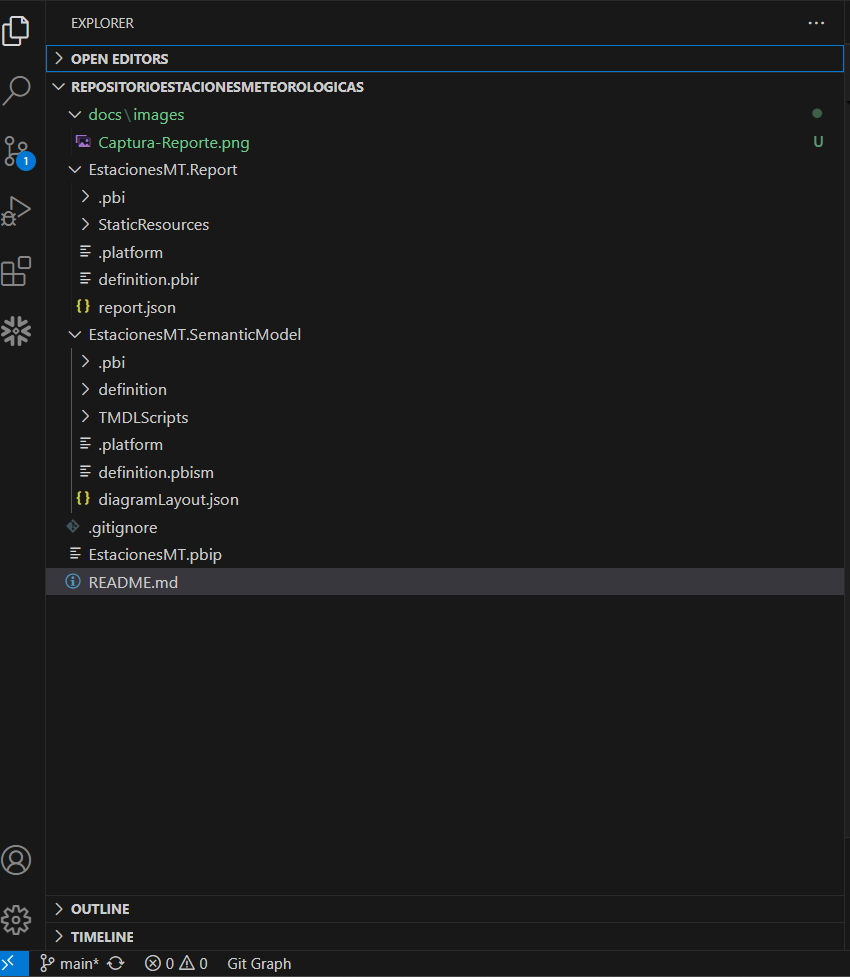
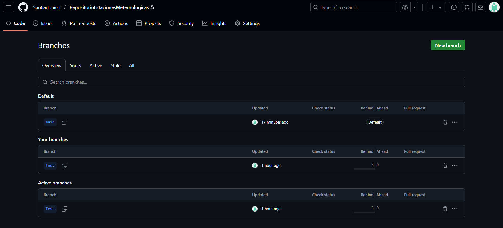
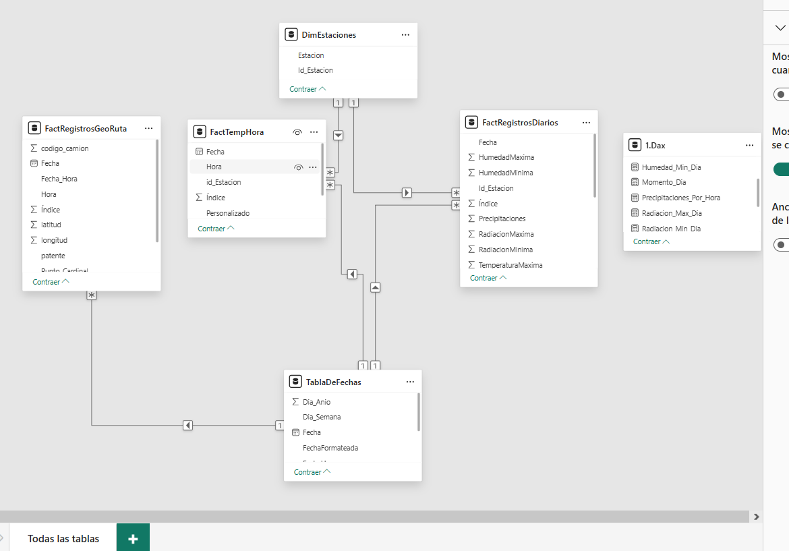
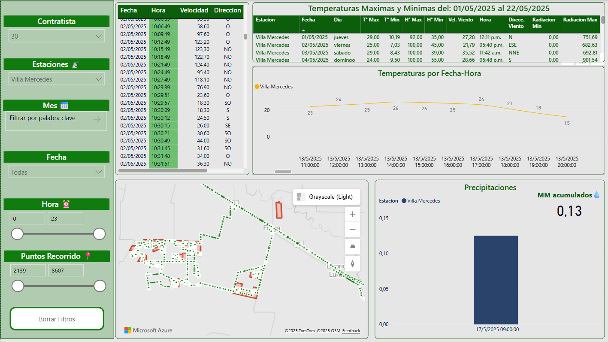

# RepoEstacionesFumigShare
Este repositorio solo contiene el README y capturas de un proyecto privado

# 🌾 Power BI - Seguimiento de Fumigaciones con Datos Meteorológicos

Este proyecto tiene como objetivo combinar datos de **seguimiento satelital de fumigadoras** con información **climática**,
para facilitar el análisis de condiciones ambientales al momento de realizar tareas agrícolas.

---

## 📌 Objetivos

- Integrar datos meteorológicos obtenidos desde una hoja de cálculo en la nube.
- Incorporar el **recorrido geolocalizado por minuto** de equipos fumigadores.
- Visualizar ambos conjuntos de datos de forma cruzada para:
  - Evaluar **condiciones climáticas durante las fumigaciones**.
  - Analizar el **impacto agronómico** si tiene o no relacón con las condiciones climaticas.
  - Optimizar el control periodico de las labores de fumigación.

---

## 📥 Fuentes de Datos

- **Hoja de cálculo SpreadSheet:**-  
  - Se utiliza una hoja Excel como base de datos de respaldo, que se alimenta diariamente mediante un script automatizado, este script obtiene los datos de APIs de registros meteorológicos por dia.
  Cada nuevo registro se pega como fila adicional, simulando una actualización incremental (restringida en cuentas gratuitas de Power BI).
  - Fuente de datos climáticos: [https://wsestaciones.sanluis.gob.ar/]

- **API de Fumigadoras:**- 
  Retorna la ruta satelital de los vehículos fumigadores: latitud, longitud, fecha y hora exacta de cada punto del recorrido.
  
---

## 🧠 Procesamiento de Datos

- Los datos se transforman en Power Query dentro de Power BI.
- Se sincronizan por **fecha y hora** para cruzar el clima con el recorrido de cada fumigación.

---

## 📊 Visualizaciones

- **Mapa geográfico** con el recorrido de cada fumigadora, con una capa visual importada (GeoJson) de los lotes donde se realizan las fumigaciones.
- Grafico de lineas de temperaturas y precipitaciones diarias por hora.
- Tabla de datos diarios por estación meteorológica.
- Filtros por:
  - Fecha
  - Equipo de fumigación
  - Hora
  - Punto de recorrido

---

## 🗂 Estructura del Proyecto

- El proyecto está organizado en dos ramas de trabajo:
  - **main**: rama de producción (publicación en Power BI Service).
  - **test**: rama de pruebas y desarrollo.
- Los cambios se desarrollan en un archivo `.pbip` sobre la rama `test`, gestionados y versionados con **Visual Studio Code + Git**.
- Una vez validados, los cambios se integran a `main` y se publica manualmente en **Power BI Service**.
- La actualización de datos está programada y automatizada, utilizando conexiones en la nube (Spreadsheet y API REST)

## Imagenes del proyecto

**Imagen de la estructura**

**Imagen de las ramas**

**Imagen del modelado**

**Imagen del Reporte**

